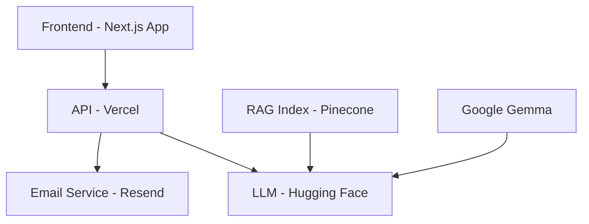

# 🚀 Portfolio Interactif - Marco Pyré

<div align="center">


[](https://nextjs.org)
[](https://vercel.com)
[](https://huggingface.co)

</div>

## 📋 Table des matières

- [🎯 À propos](#-à-propos)
- [✨ Fonctionnalités](#-fonctionnalités)
- [🏗️ Architecture](#️-architecture)
- [🚀 Déploiement](#-déploiement)
- [🛠️ Technologies](#️-technologies)
- [📦 Installation](#-installation)
- [🎨 Interface](#-interface)
- [🤖 IA & RAG](#-ia--rag)
- [🌐 Internationalisation](#-internationalisation)
- [📱 Responsive Design](#-responsive-design)
- [📄 API Endpoints](#-api-endpoints)

## 🎯 À propos

Portfolio interactif de **Marco Pyré**, développeur fullstack spécialisé en cloud native. Ce projet démontre une expertise technique moderne combinant :

- **Frontend** : Interface Next.js 15 + React 19
- **Backend** : API Routes Next.js (déployable sur Vercel)
- **IA** : Assistant conversationnel via Hugging Face Inference
- **RAG** : Pinecone pour l’index sémantique

## ✨ Fonctionnalités

### 💬 Assistant IA Interactif

- **Chat en temps réel** avec l'assistant IA
- **Questions rapides** prédéfinies pour faciliter l'interaction
- **Support multilingue** (français, anglais)
- **Actions contextuelles** (téléchargement CV, envoi d'email)

### 🎨 Interface Moderne

- **Design responsive** adapté à tous les écrans
- **Animations fluides** et effets visuels
- **Mode sombre** par défaut

### 🔧 Fonctionnalités Techniques

- **RAG (Retrieval-Augmented Generation)** pour des réponses précises
- **Gestion d'état** optimisée avec React hooks
- **Validation** côté client et serveur
- **Logging** structuré pour le debugging
- **Système de notifications email** via Resend (production uniquement)

## 🏗️ Architecture



### 📊 Stack Technique

| Composant         | Technologie           | Hébergement  |
| ----------------- | --------------------- | ------------ |
| **Frontend**      | Next.js 15 + React 19 | Vercel/Node  |
| **Backend**       | Next.js API Routes    | Vercel       |
| **IA Model**      | Google Gemma-3-27B-IT | Hugging Face |
| **RAG Database**  | Pinecone              | Pinecone     |
| **Styling**       | Tailwind CSS 4        | -            |
| **Language**      | TypeScript            | -            |
| **Email Service** | Resend                | -            |

## 🚀 Déploiement

### 🌐 Frontend

- **Framework** : Next.js App Router

### ⚡ Backend (Vercel)

- **URL** : API serverless sur Vercel
- **Performance** : Edge functions pour latence minimale
- **Scalabilité** : Auto-scaling selon la charge

### 🤖 IA & RAG (Hugging Face + Pinecone)

- **Model** : Google Gemma-3-27B-IT
- **Knowledge Base** : Index Pinecone
- **Inference** : API Hugging Face (Inference Client)

### 📧 Email Service (Resend)

- **Service** : Notifications automatiques
- **Environnement** : Production uniquement
- **Types** : Alertes d'erreur, logs de conversation, notifications de crédits
- **Destinataire** : Marco Pyré (ytmarcopyre@gmail.com)

## 🛠️ Technologies

### Frontend

```json
{
  "next": "15.3.5",
  "react": "^19.0.0",
  "typescript": "^5",
  "tailwindcss": "^4",
  "lucide-react": "^0.525.0"
}
```

### Backend & IA

```json
{
  "@huggingface/inference": "^4.3.2",
  "resend": "^3.0.0",
  "@radix-ui/react-scroll-area": "^1.0.5",
  "class-variance-authority": "^0.7.1"
}
```

## 📦 Installation

### Prérequis

- Node.js 18+
- npm ou yarn
- Compte Hugging Face (pour l'API)

### Installation locale

```bash
# Cloner le repository
git clone https://github.com/marcopyre/portfolio.git
cd portfolio

# Installer les dépendances
npm install

# Configurer les variables d'environnement
cp .env.example .env.local
# Éditer .env.local avec vos clés API

# Lancer en mode développement
npm run dev
```

### Variables d'environnement

```env
# Hugging Face API
HF_TOKEN=your_huggingface_token

# Pinecone API
PINECONE_API_KEY=your_pinecone_token

# Resend API
RESEND_API_KEY=your_resend_token

# Resend Email Service (pour les notifications)
RESEND_API_KEY=your_resend_api_key
```

## 🎨 Interface

### Design System

- **Couleurs** : Palette cyberpunk (noir, violet, cyan)
- **Typographie** : Système par défaut
- **Animations** : `tw-animate-css` + CSS keyframes
- **Icons** : Lucide React pour la cohérence

### Composants UI

- `Button` : Boutons avec variants (primary, secondary, ghost)
- `ScrollArea` : Zone de défilement personnalisée
- `ChatMessage` : Messages de chat avec markdown
- `TypingIndicator` : Indicateur de frappe animé

## 🤖 IA & RAG

### Assistant Conversationnel

- **Model** : Google Gemma-3-27B-IT via Hugging Face
- **Context** : 4096 tokens maximum
- **Temperature** : 0.7 pour créativité équilibrée
- **Functions** : Actions contextuelles (CV, email)

## 📧 Services

### Email Service (Resend)

- **Environnement** : Production uniquement (`NODE_ENV=production`)
- **Notifications** : Alertes d'erreur, logs de conversation, crédits épuisés
- **Configuration** : Variable d'environnement `RESEND_API_KEY`
- **Sécurité** : Emails désactivés en développement pour éviter les envois accidentels

### Base de Connaissances

- **Stockage** : Index vectoriel Pinecone
- **Stratégie** : Filtrage dynamique par score/écarts et budget de tokens

### Fonctions Disponibles

```typescript
// Téléchargement du CV
get_resume(): Promise<void>

// Envoi d'email de contact
send_contact_email(sujet: string, message: string): Promise<void>

// Ouverture du Github du projet
get_source_code(): Promise<void>

// Ouverture du site ostea38.fr
get_ostea38(): Promise<void>
```

## 🌐 Internationalisation

### Langues Supportées

- 🇫🇷 **Français** (par défaut)
- 🇬🇧 **Anglais**

### Structure i18n

```
i18n/
├── en.json      # Traductions anglaises
├── fr.json      # Traductions françaises
├── language-provider.tsx
└── use-translation.ts
```

## 📱 Responsive Design

### Breakpoints

- **Mobile** : < 768px
- **Tablet** : 768px - 1024px
- **Desktop** : > 1024px

### Optimisations

- **Images** : Lazy loading et formats optimisés
- **Fonts** : Système
- **Performance** : Code splitting automatique

## 📄 API Endpoints

### Chat API

```typescript
POST /api/chat
{
  "messages": [
    {
      "role": "user",
      "content": "Bonjour, parlez-moi de vos compétences"
    }
  ]
}

Response:
{
  "response": "Je suis Marco Pyré, développeur fullstack...",
  "images": ["image_id"],
  "function_call": {
    "name": "get_resume",
    "parameters": {}
  }
}
```

## 🚨 Gestion d'Erreur & Notifications

### Crédits Hugging Face Épuisés

Le système détecte automatiquement les erreurs de crédits Hugging Face et :

1. **Affiche un message utilisateur** : "Je suis à court de token, une notification a été envoyé à Marco, le soucis seras corrigé d'ici peu."
2. **Envoie une notification email** à Marco via Resend (production uniquement)
3. **Log les erreurs** pour le debugging

### Système de Notifications Email

Le système envoie automatiquement des emails via Resend **uniquement en production** :

- **Alertes de crédits épuisés** : Notification immédiate quand les crédits Hugging Face sont épuisés
- **Logs de conversation** : Chaque conversation utilisateur + réponse du bot
- **Erreurs système** : Notifications pour les erreurs techniques

### Configuration Resend

1. Créez un compte sur [Resend](https://resend.com)
2. Obtenez votre clé API
3. Configurez la variable d'environnement `RESEND_API_KEY`
4. Vérifiez votre domaine d'envoi dans Resend
5. Les emails ne sont envoyés qu'en environnement de production (`NODE_ENV=production`)

---

<div align="center">

**Développé avec ❤️ par Marco Pyré**

[](https://linkedin.com/in/marcopyre)
[](https://github.com/marcopyre)
[](mailto:ytmarcopyre@gmail.com)

</div>
